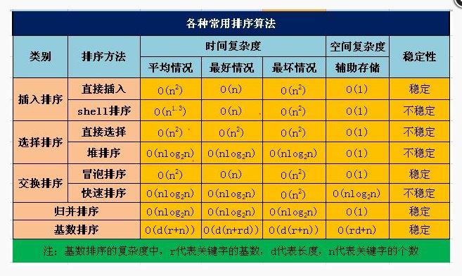

# Problem-Solving-with-Algorithms-and-DataStructures
Note learning process
目录
---
1. [最大公约数](#1)
2. [寻找列表里的最小数](#2)
3. [infinite monkey theorem](#3)
4. [Anagram Detection(异序string)](#4)
5. [List和Dict的一些操作复杂度](#5)
6. [找出无序列表中的第k小的数](#6)
7. [堆的基本概念](#7)
8. [队列的基本概念](#8)

<h2 id='1'>1.最大公约数：</h2>

欧几里德算法又称辗转相除法， 用于计算两个整数a, b的最大公约数。其计算原理依赖于下面的定理：
定理： gcd(a, b) = gcd(b, a mod b)
```Python
    class Fraction:   

        def __init__(self, top, bottom):
            self.num = top
            self.deco = bottom
        
        def __repr__(self):
            return str(self.num) + "/" + str(self.deco)
        
        def __add__(self, other):
            new_num = self.num * other.deco + self.deco * other.num
            new_deco = self.deco * other.deco
            if new_num > new_deco:       
                gcd_num = new_deco
                gcd_deco = new_num
            else:
                gcd_num = new_num
                gcd_deco = new_deco
            while gcd_deco % gcd_num != 0:
                gcd_deco, gcd_num = gcd_num, gcd_deco % gcd_num
            print gcd_num
        return Fraction(new_num/gcd_num, new_deco/gcd_num)  
```

<h2 id='2'>2. 寻找列表里的最小数:</h2>

O(n2)和O(n)复杂度的比较
```Python
    def find_mininum_in_list_02(ToUsedList):
        mininum = ToUsedList[0]
        for i in ToUsedList:
            if mininum > i:
                mininum = i
        return mininum

    def find_mininum_in_list_01(ToUsedList):
        mininum = ToUsedList[0]
        for i in ToUsedList:
            ismininum = True
            for j in ToUsedList:
                if i > j:
                    ismininum = False
            if ismininum:
                mininum = i
        return mininum
```    

<h2 id='3'>3.infinite monkey theorem:</h2>

```Python
    import random,string

    # shakespeare = 'methinks it is a weasel'
    shakespeare = 'abc'
    quoteLen = len(shakespeare)


    def generate():
        char = string.ascii_lowercase+' '
        randchars = ''.join(random.choice(char) for _ in range(quoteLen))
        return randchars


    def score():
        scorenum = 0
        randchars = generate()
        shake = shakespeare.split()
        randlist = randchars.split()
        for i,j in zip(shake,randlist):
            if i==j:
               scorenum += 1
        scorecount = (scorenum / quoteLen) * 100
        return scorecount

    def main():
        run = 0
        curScore = 0
        while not(curScore == 100):
            curScore = score()
            if curScore != 0:
                print(run, " = ", curScore)
            run += 1

    if __name__ == '__main__':
        main()
```

<h2 id='4'>4. Anagram Detection(异序string):</h2>

方案1--逐个比较  

```Python
    def anagram_solution1(str1, str2):
        total_found = True
        for i in str1:
            found = False
            for j in str2:
                if i == j:
                    found = True
            if not found:
                total_found = False
                break
        return total_found
```        
方案2--用sort排序后比较  
```Python
    def anagram_solution2(str1, str2): 
        list1 = list(str1)
        list2 = list(str2)
        list1.sort()
        list2.sort()
        match_list1 = ''.join(list1)
        match_list2 = ''.join(list2)
        match = False
        if match_list1 == match_list2:
            match = True
        return match
```       

<h2 id='5'>5. List和Dict的一些操作复杂度</h2>

- Devise an experiment to verify that the list index operator is 𝑂(1)

```Python
    import timeit
    import random

    for i in xrange(10000, 100000, 20000):
        x = list(range(i))
        t = timeit.Timer('x[random.randrange(%d)]' % i, 'from __main__ import x, random')
        index_time = t.timeit(number=1000)
        print('%d time: %10.7f' % (i, index_time))
```
   
- Devise an experiment that compares the performance of the del operator on lists and dictionaries.
```Python
    import timeit
    import random

    for i in xrange(10000, 100000, 20000):
        d = {j: None for j in xrange(i)}
        l = range(i)
        t1 = timeit.Timer('del d[random.randint(0, i)]',
                      'from __main__ import i, random, d ')
        t2 = timeit.Timer('del l[random.randint(0, i)]',
                      'from __main__ import i, random, l ')
        dict_del_time = t1.timeit(number=100)
        list_del_time = t2.timeit(number=100)
        print('%d list time: %10.7f' % (i, list_del_time))
        print('%d dcit time: %10.7f' % (i, dict_del_time))
```

<h2 id='6'>6. 找出无序列表中的第k小的数：</h2>

- 自己想到的一个办法,每次循环找出最小的数放进smallest_kth_list，然后pop掉原列表中的这个数，继续循环找最小数：
```Python
    def find_kth_samllest_num_01(NumList, k):
        smallest_kth_list = NumList[0:k]
        if k > len(NumList):
            return NumList
        for i in xrange(k):
            pop_n = 0
            numList_len = len(NumList)
            for j in xrange(numList_len-1):
                if NumList[j] < smallest_kth_list[i]:
                    smallest_kth_list[i] = NumList[j]
                    pop_n = j
            NumList.pop(pop_n)
        return smallest_kth_list[k-1]
```
- 快速排序:    为什么这个算法比第一个慢那么多？？？
```Python
    def find_kth_samllest_num_02(NumList):
        low = []
        pivotlist = []
        high = []
        if len(NumList) < 1:
            return NumList
        pivot = NumList[0]
        for i in NumList:
            if i < pivot:
                low.append(i)
            elif i > pivot:
                high.append(i)
            else:
                pivotlist.append(i)
        low = find_kth_samllest_num(low)
        high = find_kth_samllest_num(high)
        return low + pivotlist + high
```
<h2 id='7'>7. 堆的基本概念：</h2>

- 定义(左边是尾，右边是首)
```Python
    class Stack():
        def __init__(self):
            self.items = []

        def is_empty(self):
            return self.items == []

        def push(self, item):
            self.items.append(item)

        def pop(self):
            return self.items.pop()

        def peek(self):
            return self.items[len(self.items)-1]

        def size(self):
            return len(self.items)

        def __str__(self):
            return 'stack: %s' % self.items
```
- 用stack反转字符串
```Python
    def rev_string(my_str):
        s = Stack()
        my_str_rev = ''
        for i in my_str:
            s.push(i)
        while not s.is_empty():
            my_str_rev += s.pop()
        return my_str_rev
```
- Simple Balance Parentheses
```Python
    def check_balance_parentheses(parentheses_string):
        s = Stack()
        balance = True
        index = 0
        parentheses_string_len = len(parentheses_string)
        while index < parentheses_string_len and balance:
            parenthesis = parentheses_string[index]
            if parenthesis == '(':
                s.push(parenthesis)
            else:
                if s.is_empty():
                    balance = False
                try:
                    s.pop()
                except:
                    return False
            index += 1
        if balance and s.is_empty():
            return True
        else:
            return False
```
- 十进制转化为任意进制

```Python
    def decimal_to_base(decimal_num, base):
        s = Stack()
        binary_of_decimal = ''
        digits = '0123456789ABCDEF'
        while decimal_num > 0:
            remainder = decimal_num % base
            s.push(remainder)
            decimal_num /= base

        while not s.is_empty():
            binary_of_decimal += digits[s.pop()]

        return binary_of_decimal
```

<h2 id='8'>8. 队列基本的概念：</h2>

- 定义
```Python
    class Queue:
        def __init__(self):
            self.items = []

        def is_empty(self):
            return self.items == []

        def enqueue(self, item):
            self.items.insert(0, item)

        def dequeue(self):
            return self.items.pop()

        def size(self):
            return len(self.items)

        def __repr__(self):
            return 'Queue: %s' % self.items
```

- Hot-Potato

```Python
    def hot_potato(potato_list, num):
        potato_q = Queue()
        for i in potato_list:
            potato_q.enqueue(i)   # 将potato_list列表转化为队列Queue

        while potato_q.size() > 1:
            for y in xrange(num):
                dequeue_num = potato_q.dequeue()
                potato_q.enqueue(dequeue_num)    # 将接到potato的人从队首取出，插入到队尾
            potato_q.dequeue()     # 完成num次接力后，将队首的人淘汰，直到队列的大小为1

        return potato_q.dequeue()

```
